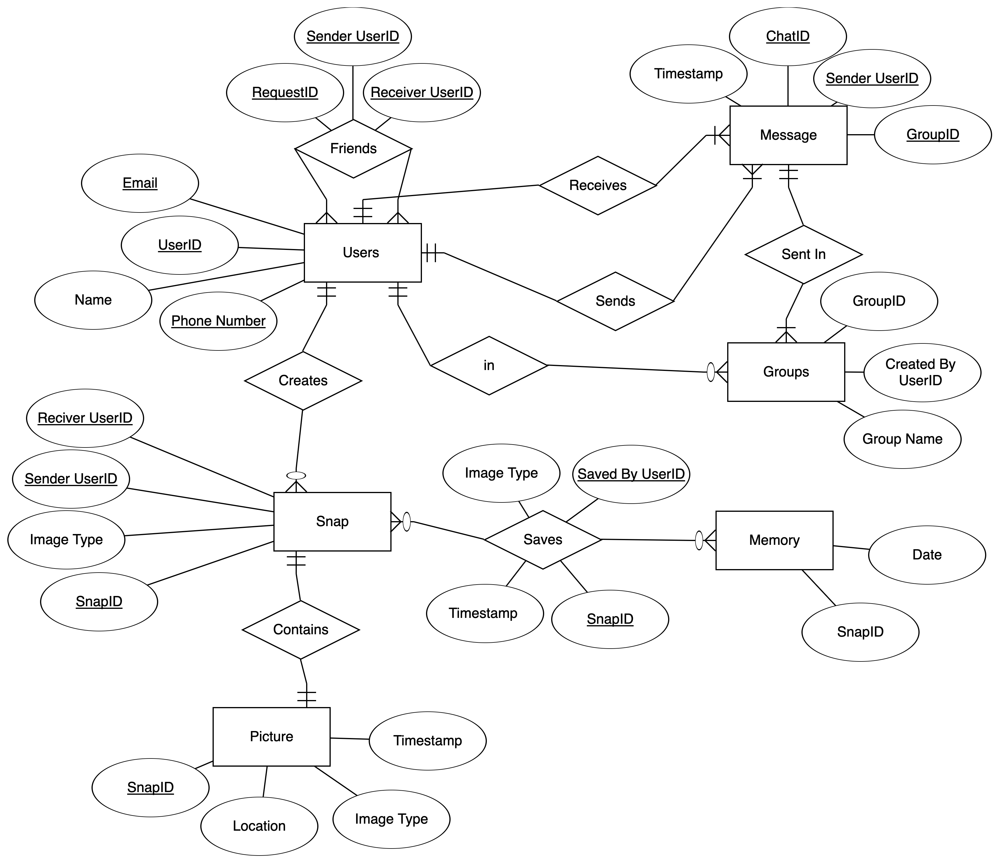

# SnapChat Database Overview

This database is designed to support the management of user interactions on a social media platform similar to Snapchat by organizing data related to users, messages, snaps, friend requests, and groups. The Users table stores details about individuals, identified by their unique user ID, with additional information such as email, name, and phone number. Each user can send messages or snaps, which are recorded in the Message and Snap tables, respectively. The Message table tracks communication between users within specific group chats, while the Snap table records the sharing of photos or videos between users, storing metadata such as image type and sender/receiver information.

The Friend table manages the relationships between users, tracking incoming and outgoing friend requests. When users save snaps, this action is recorded in the Saves table, providing insight into user engagement with the shared content. The Picture table stores additional metadata for snaps, such as location and timestamp.

The Groups table organizes users into groups for group chats, and the Memory table stores a history of saved snaps, allowing users to revisit past shared moments. This database ensures that interactions such as messaging, snapping, and friend requests are efficiently managed and retrievable, enabling platform administrators to monitor user behavior, track engagement, and maintain a smooth user experience.

## Entity Relational Model

## Relational Model 

## Source Code

* [Create Script (DDL)](Create.SQL)
* [Populate Script (DML)](Populate.SQL)

## Queries

Query 1
Find all the users who have received a friend request from a specific user.
SELECT U.Name, U.UserID, F.Sender_UserID, F. Receiver_UserID  
FROM Users as U
JOIN Friend as F on U.UserID = F.Receiver_UserID
WHERE F.Sender_UserID = '1';

Query 2

Show all the messages from a group chat

SELECT M.timestamp, M.sender_UserID, M.Group_ID, G.Group_Name
FROM Message as M 
JOIN Groups as G on M.Group_ID = G.Group_ID
WHERE G.Group_ID = '1';

Query 3

Counting the amount of snaps saved by a specific user - Aggregation

SELECT COUNT (S.Snap_ID) as NumberOfSnapsSaved
FROM Saves as S
WHERE S.Saved_By_UserID = '2';

Query 4

Find The Names of USers and the Number of snaps they’ve sent.

SELECT U.Name, COUNT(S.SnapID) AS NumberOfSnapsSent
FROM Users AS U
JOIN Snap AS S ON U.UserID = S.Sender_UserID
GROUP BY U.Name
ORDER BY NumberOfSnapsSent DESC;

Query 5

Estimated storage per snap
SELECT  U.Name, 
COUNT(S.SnapID) AS NumberOfSnapsSent, 
COUNT(S.SnapID) * 2.5 AS EstimatedStorageMB
FROM Users AS U
JOIN Snap AS S ON U.UserID = S.Sender_UserID
GROUP BY U.Name
ORDER BY EstimatedStorageMB DESC;

